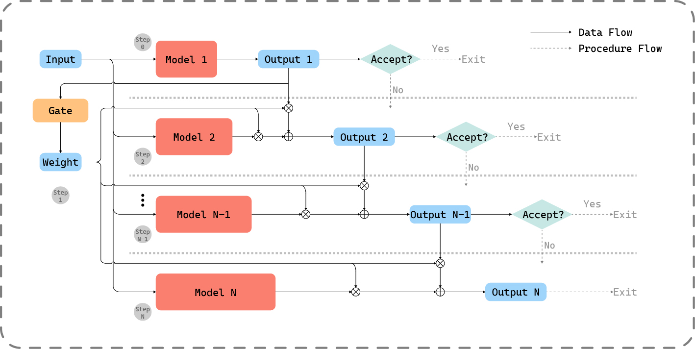

<!--
 * @Author: Guoxin Wang
 * @Date: 2025-03-19 16:20:13
 * @LastEditors: Guoxin Wang
 * @LastEditTime: 2026-06-04 13:38:40
 * @FilePath: /DMMECG/README.md
 * @Description:
 *
 * Copyright (c) 2025 by Guoxin Wang, All Rights Reserved.
-->

## DMMECG: Dynamic Model Mixture for Electrocardiogram

<p align="center">
  
</p>

This is a PyTorch/GPU implementation of the paper [DMMECG](https://ieeexplore.ieee.org/document/11426826):

```
@article{wang2026dynamic,
  title={Dynamic Model Mixtures for Efficient AI Inference in Real-Time Biomedical Applications},
  author={Wang, Guoxin and Wang, Qingyuan and Iyer, Ganesh Neelakanta and John, Deepu},
  journal={IEEE Transactions on Instrumentation and Measurement},
  year={2026},
  publisher={IEEE}
}
```

### Requirement

Install the required package:

```
conda env create --file environment.yml
```

Activate environment:

```
conda activate dmmecg
```

### Data Generation

To generate labelled ECG datasets, run the following command:

```
python data_gen.py \
    --task ${task} \
    --data_path ${data_path} \
    --output_dir ${output_dir} \
    --width 240 \
    --channel_names ${channel_names} \
    --num_class 4
```

- Choose `task` from _af_beat_ and _id_beat_.
- Set `--prefix ${prefix}` when original data path is nested.
- Set `--num_class 2` or `--num_class 5` for different classifications.
- Set `--inter` to generate datasets from MITDB with special splits.
- Set `--expansion ${expansion}` for simple data augumentation.

### Gate Training

To train a gate with multi-node distributed training, run the following on 1 node with 2 GPUs each:

```
OMP_NUM_THREADS=20 torchrun --nnodes=1 --nproc-per-node=2 main.py \
    --batch_size 512 \
    --experts ${experts} \
    --pool ${pool} \
    --lr 3e-4 \
    --train_path ${train_path} \
    --test_path ${test_path} \
    --output_dir ${output_dir} \
    --log_dir ${log_dir}
```

- Here the effective batch size is 512 (`batch_size` per gpu) \* 1 (nodes) \* 2 (gpus per node) \* 1 (`accum_iter`) = 1024.
- Experts are pre-trained from [MAECG](https://github.com/PriceWang/MAECG/tree/main). Set `--experts vit_tiny_${task} vit_small_${task} vit_base_${task}` with _af_ or _id_ for different tasks. Register customized architectures in [_utils/dmm_models.py_](./utils/dmm_models.py) to evaluate more (make sure the shape is consistent).
- Base on experts architecture, choose `pool` from _avg_ and _none_.
- Set `--train_path ${data_path_1} ${data_path_2} ...` and `--test_path ${data_path_1} ${data_path_2} ...` to train and valid with multiple datasets.

### Evaluation

Evaluate arrhythmia classification and human identification on test dataset in a single GPU:

```
python main.py \
    --experts ${experts} \
    --pool ${pool} \
    --test_path ${test_path} \
    --output_dir ${gate_ckpt} \
    --eval_thre ${threshold} \
    --eval
```

- Set `--probs_weighting` to enable probability weighting.

### Results

We rank #1 Acc in these tasks:

<table align="center" style="text-align: center;">
  <thead>
    <tr>
      <th rowspan="2" style="text-align: center;">Model</th>
      <th colspan="2" style="text-align: center;">Arrhythmia Classification</th>
      <th colspan="2" style="text-align: center;">Identification</th>
    </tr>
    <tr>
      <th style="text-align: center;">FLOPs (M)</th>
      <th style="text-align: center;">Accuracy (%)</th>
      <th style="text-align: center;">FLOPs (M)</th>
      <th style="text-align: center;">Accuracy (%)</th>
    </tr>
  </thead>
  <tbody>
    <tr>
      <td>Tiny</td>
      <td>20.10</td>
      <td>94.60</td>
      <td>20.11</td>
      <td>95.27</td>
    </tr>
    <tr>
      <td>Small</td>
      <td>80.01</td>
      <td>95.15</td>
      <td>100.13</td>
      <td>96.80</td>
    </tr>
    <tr>
      <td>Base</td>
      <td>319.27</td>
      <td>95.45</td>
      <td>419.44</td>
      <td>97.67</td>
    </tr>
    <tr>
      <td><strong>DMM</strong></td>
      <td><strong>115.73</strong></td>
      <td><strong>95.51</strong></td>
      <td><strong>109.35</strong></td>
      <td><strong>97.94</strong></td>
    </tr>
  </tbody>
</table>

### License

This project is licensed under the terms of the MIT license. See [LICENSE](LICENSE) for details.
